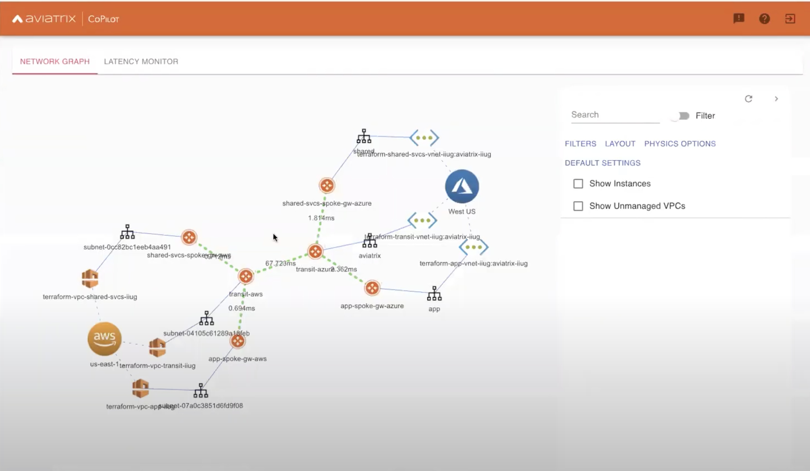

# aviatrix-terraform-consul-webinar

## Overview
This repo will deploy a multi-cloud Consul solution on top of Aviatrix networking platform.
You can use Terraform to deploy the solution end-to-end.
See the instructions below to deploy this to your AWS & Azure environments.

## Demo Video
You can see the webinar video for this here: https://youtu.be/Irt81hskUIg

## Topology
The below diagram is a [Aviatrix Co-Pilot](https://aviatrix.com/cloud-network-platform/) rendering of the environment.

## Instructions
To deploy the solution run the Terraform modules in the following order.

1. [Infra](terraform/infra)
1. [Aviatrix](terraform/aviatrix)
1. [Transit](terraform/transit)
1. [Consul](terraform/consul)
1. [Workloads](terraform/workloads)

## Run the demo
You can send traffic to the frontend application endpoint after you have deployed the [workloads](terraform/workloads) applications.
The application will be available via the EKS managed AWS LB.  

Envoy application traces configured by Consul will be available in the Jaeger UI.
If you have a CoPilot license you can connect it to this environment and follow along with the steps in the webinar video.
